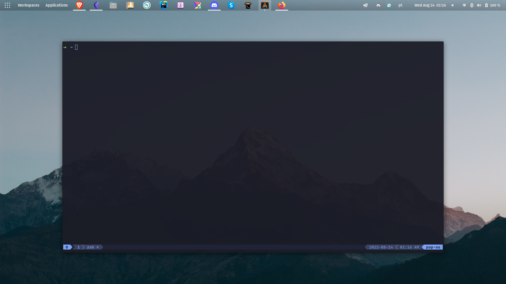
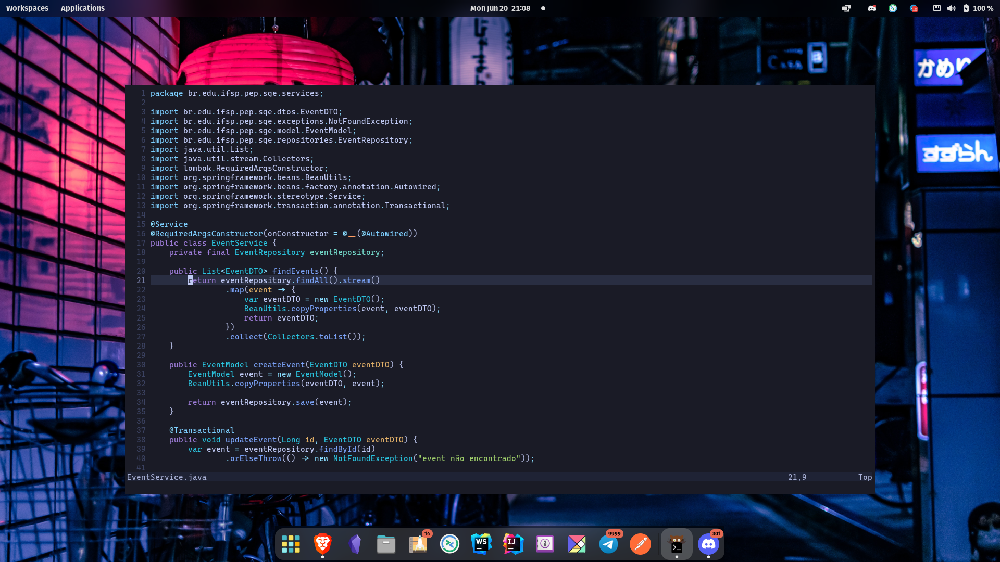

# Dotfiles




## Install in a new system
 - https://www.atlassian.com/git/tutorials/dotfiles
 - https://news.ycombinator.com/item?id=11071754

Antes de começar garanta que o alias esteja presente no .bashrc or .zsh:
```bash
alias config='/usr/bin/git --git-dir=$HOME/.cfg/ --work-tree=$HOME'
```

Adicione o repositório no .gitignore para evitar problemas estranhos de recursao:
```bash
echo ".cfg" >> .gitignore
```
Faça o clone do seu dotfiles em um repositório bare:
```bash
git clone --bare git@github.com:phaalonso/dotfiles.git $HOME/.cfg
```
Configure o alias no shell atual:
```bash
alias config='/usr/bin/git --git-dir=$HOME/.cfg/ --work-tree=$HOME'
```
Realize checkout pro conteudo do seu repositório para o $HOME:
```bash
config checkout
```
Durante esse processo, pode ocorrer conflitos de arquivos. Nesse caso voce pode apagar manualemente, ou executar o seguinte script que ira mover tudo pra uma pasta de backup:
```bash
mkdir -p .config-backup && \
config checkout 2>&1 | egrep "\s+\." | awk {'print $1'} | \
xargs -I{} mv {} .config-backup/{}
```
Entao rode o checkout novamente
```bash
config checkout
```
Configure a flag para nao mostrar arquivos que nao estao no controle de versao:
```bash
config config --local status.showUntrackedFiles no
```

Exemplos:
```
config status
config add .vimrc
config commit -m "Add vimrc"
config add .bashrc
config commit -m "Add bashrc"
config push
```
Again as a shortcut not to have to remember all these steps on any new machine you want to setup, you can create a simple script, store it as Bitbucket snippet like I did, create a short url for it and call it like this:

```bash
git clone --bare git@github.com:phaalonso/dotfiles.git $HOME/.cfg
function config {
   /usr/bin/git --git-dir=$HOME/.cfg/ --work-tree=$HOME $@
}
mkdir -p .config-backup
config checkout
if [ $? = 0 ]; then
  echo "Checked out config.";
  else
    echo "Backing up pre-existing dot files.";
    config checkout 2>&1 | egrep "\s+\." | awk {'print $1'} | xargs -I{} mv {} .config-backup/{}
fi;
config checkout
config config status.showUntrackedFiles no
```


Hyperland config baseada em [JaKooLit](https://github.com/JaKooLit?tab=repositories)
